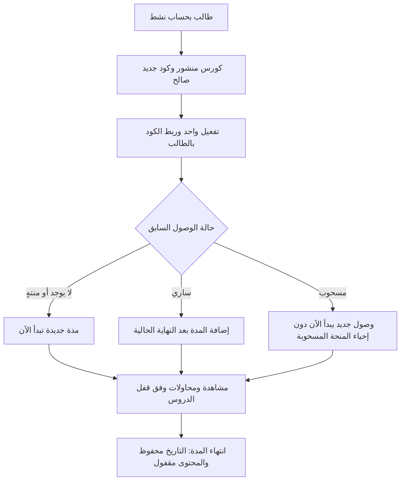

# F02 — حالات المنصة وقواعد الانتقال

تاريخ الإعداد: **2026-10-02**. الناتج: مواصفة تأسيسية جاهزة لمراجعة تصميم البيانات F03، مع [أمثلة نجاح ورفض لكل انتقال](F02-transition-examples.ar.md). هذه قواعد موثقة، وليست تنفيذًا أو اختبارات تشغيل للمنصة.

مصدر السلوك هو [قرارات المنتج](../phase-1/decisions.ar.md) و[معايير القبول](../phase-1/acceptance-criteria.ar.md). وافق المستخدم على إعداد الحالات بعد تجارب الحسابات، ثم أكد D28: العودة لكورس سُحب الوصول إليه بكود جديد، إذا كان الحساب نشطًا والكورس منشورًا. الأسماء التقنية وطريقة حفظ الحالات التالية اختيارات تنفيذ للمراجعة؛ لا تغيّر القواعد المعتمدة ولا تختار مزود Auth نهائيًا.

## خريطة الحالات الأساسية

| الكيان | حالاته | ما يبقى مستقلًا عنه |
|---|---|---|
| الحساب | `active` نشط، `disabled` معطل | الدور `student/admin`، قفل تجهيز الحساب أو الاستعادة، حالة كل كورس وموعد الاشتراك |
| الكورس | `draft` مسودة، `published` منشور، `archived` مؤرشف | صلاحية الوصول لكل طالب، مسودات الدروس الجديدة، إصدارات التقييمات |
| الكود | `available` غير مستخدم، `used` مستخدم، `cancelled` ملغى | أهلية التفعيل مشتقة من آخر موعد للتفعيل وحالة الكورس؛ لا حالة مخزنة إضافية اسمها «منتهي» |
| وصول طالب لكورس | لا وصول سابق، `active` ساري، `expired` منتهٍ، `withdrawn` مسحوب | الحساب قد يكون معطلًا والوصول ما زال ضمن مدته؛ انتهاء الوقت لا يحذف التقدم والنتائج |
| محاولة تقييم | `in_progress` جارية، `submitted` مسلمة | الحفظ على الجهاز ليس حفظ خادم؛ الانقطاع أو انتهاء الاشتراك ليس حالة تسليم مستقلة |

حالة الوصول المنتهي تعتمد على وقت الخادم. حالة «لا وصول سابق» نتيجة عدم وجود تفعيل، لا اشتراكًا وهميًا يُنشأ عند تصفح الكورس. العرض «متاح/مقفول للطالب» يجمع هذه القواعد ولا يصبح حالة جديدة للكورس.

## الحدود ومسارات المستخدم

| المسار | الأفعال | التحقق قبل النجاح |
|---|---|---|
| طالب: حساب | التسجيل والدخول والخروج، طلب دعم السنتر | التسجيل بالاسم والصف والموبايل والكلمة؛ الدور لا يختاره الطالب. الاستعادة ينفذها أدمن بعد تحقق حضوري وفق F01 |
| طالب: اكتشاف | مدرسون وفلاتر وصف ومادة وتفاصيل كورس وعناوين دروس | الكورس منشور؛ عرض المنهج لا يمنح فيديو أو أسئلة محمية |
| طالب: تفعيل | إدخال كود، عرض اسم الكورس، تأكيد التفعيل أو التجديد | الحساب نشط، والكود للكورس المؤكد، والكورس منشور، والكود لم يُستهلك ولم تنتهِ أهلية تفعيله |
| طالب: كورساتي | مشاهدة الوصول الساري أو التاريخ المنتهي/المسحوب | الحساب نشط وصاحب البيانات؛ الكورس المؤرشف الذي سبق تفعيله يظل في المسار الشخصي |
| طالب: تعلم | إصدار تشغيل، حفظ موضع، إكمال درس، واجب، فتح التالي | وصول ساري، درس منشور ومفتوح. إكمال الفيديو ونجاح الواجب قاعدتان مستقلتان |
| طالب: امتحان | بدء واستئناف وحفظ وتسليم ثم نتيجة ونموذج | ملكية المحاولة، الموعد، الحالة، حدود المحاولات؛ استثناء انتهاء الاشتراك في المحاولة الجارية فقط |
| أدمن: محتوى | مدرسون وصفوف ومواد، مسودة ومنهج وفيديو وتقييم، نشر وأرشفة | دور أدمن موثوق وحساب نشط؛ المدرس سجل بيانات دون حساب دخول |
| أدمن: أكواد | توليد دفعة وتصدير وإلغاء ومراجعة تفعيل | كود لكورس ومدة محددين؛ سر الكود الكامل للأدمن في التصدير المسموح فقط؛ إعادة الطلب لا تولد دفعة ثانية بصمت |
| أدمن: دعم | تعطيل وإعادة تفعيل، استعادة، سحب وتمديد، تجاوز درس | طالب وهدف واضحان، سبب أو مرجع تحقق وسجل للفاعل والوقت؛ كل إجراء يغيّر هدفه فقط |

هذه مسارات وظيفية وليست أسماء URL نهائية أو مصفوفة F04 الكاملة. الطالب لا يمرر دوره أو هوية المالك لتصبح مصدر صلاحية. الحساب المعطل أو المقفول للاستعادة لا ينفذ عمليات الطالب المحمية. ترتيب قواعد العملية: هوية وحالة حساب، ثم دور/ملكية، ثم حالة المورد ووقت الخادم، ثم التغيير الذري المطلوب.

## الحساب

| الانتقال | الفعل والشروط | الأثر | المرجع |
|---|---|---|---|
| A01 لا حساب → نشط | تسجيل صحيح وهوية واحدة وملف مكتمل | طالب ثابت الدور، وهاتف موحد فريد؛ إعادة الطلب لا تنشئ حسابًا ثانيًا | D01/D03/D24، AC01 |
| A02 نشط → معطل | أدمن نشط وسبب مسجل | رفض التفعيل والمشاهدة والمحاولات وحفظ الإجابات، مع إبقاء التاريخ وموعد الاشتراك | D18، AC02 |
| A03 معطل → نشط | أدمن نشط وإجراء مسجل | العودة حسب حالات الوصول الحالية؛ لا أيام تعويض تلقائية ولا إلغاء لسحب سابق | D18، AC02 |
| A04 نشط/معطل → الحالة نفسها | استعادة بتوثيق تحقق حضوري | قفل مؤقت وبيانات تغيير مرة واحدة وفق F01؛ تغيير الكلمة لا يعيد تفعيل المعطل | D24/D18، AC01/02 |

الدخول والخروج لا يغيران حالة الحساب أو مدته. الحجز وتجهيز الملف والاستعادة مراحل تشغيل داخلية مستقلة؛ لا تتحول هوية غير مكتملة إلى طالب يستطيع استخدام المنصة. لا حذف حساب مستخدم وتاريخه ضمن هذه الدفعة. التعطيل ليس تجميدًا للاشتراك.

## الكورس والمنهج

| الانتقال | الفعل والشروط | الأثر | المرجع |
|---|---|---|---|
| C01 لا كورس → مسودة | أدمن يحفظ مسودة مرتبطة بمدرس وصف ومادة | المسودة للإدارة؛ لا اكتشاف ولا تفعيل أو محتوى طالب | D01/D26، AC19 |
| C02 مسودة → منشور | أدمن يحدد المحتوى المراد نشره؛ بياناته وتقييماته صحيحة وفيديو كل درس منشور جاهز | يظهر الكورس ويقبل التفعيل؛ مسودات حصص المستقبل لا تنشر معه تلقائيًا | D26، AC19/25 |
| C03 منشور → مؤرشف | أدمن يؤرشف الكورس | يختفي من الاكتشاف ويرفض تفعيلًا جديدًا بلا استهلاك الكود؛ الوصول السابق يظل حتى نهايته | D16، AC20 |
| C04 منشور → منشور | إضافة درس جاهز في نهاية المنهج ونشره | معرفات الدروس القديمة وتقدمها ثابتة؛ مسودة درس جديد تبقى غير ظاهرة | D25/D26، AC12/19 |
| C05 أي حالة → نفسها | أدمن يصحح عنوانًا أو وصفًا شكليًا | لا تغيير لمعنى المحتوى أو التقدم أو التفعيل أو إصدار محاولة | D25، AC12/20 |
| C06 مسودة درس غير مستخدم → معدلة/محذوفة | اختيار تنفيذ: أدمن، درس مسودة بلا أي مرجع استخدام، وترتيب صالح بعد التعديل | لا يسمح باستعمال هذا المسار لحذف/ترتيب درس مستخدم أو تغيير تاريخ طالب | D25، AC12 |

نشر أول جزء جاهز لا يشترط رفع كل حصص الشهر؛ معيار الجاهزية يراجع الجزء المنشور فعلًا. عند C04 يبقى للدرس الواجب الذي يربط فتح التالي حيث توجد بوابة واجب. نشر التقييم وصحة محتواه يكتملان في مرحلة التقييمات قبل الإطلاق.

المؤرشف لا يُحذف بدل أرشفته، والكود غير المستخدم له يظل غير مستهلك رغم رفض التفعيل. استرجاع الأرشفة أو إعادة كورس منشور إلى مسودة ليس مسارًا معتمدًا في F02؛ تصميم البيانات لا يفترض وجوده. تعديل امتحان منشور لا يتم بتعديل نسخة استخدمها طالب؛ له إصدار جديد M06.

## الكود والتفعيل

| الانتقال | الفعل والشروط | الأثر | المرجع |
|---|---|---|---|
| K01 لا أكواد → متاحة | أدمن يولد عددًا معلومًا، لكورس واحد ومدة 30/60/90 يومًا وآخر تفعيل اختياري | دفعة وأكواد فريدة؛ إعادة نفس طلب التوليد تعيد الدفعة نفسها | D04/D06، AC21 |
| K02 متاح → مستخدم | طالب نشط، تأكيد الكورس المطابق، كورس منشور، و`now < activate_before` إن وُجد | ملكية واحدة وتفعيل واحد ومنحة وصول في عملية ذرية؛ لا استهلاك قبل نجاح إنشاء الوصول | D04/D06/D28، AC04/05/07 |
| K03 متاح → ملغى | أدمن يلغي غير المستخدم | لا تفعيل بعده؛ إعادة الإلغاء لا تغير الملكية أو تنتج إجراءين نهائيين | D08، AC09 |
| K04 مستخدم → مستخدم | المالك نفسه يعيد إدخال الكود | نتيجة التفعيل السابق مع حالة الوصول الحالية؛ بلا زيادة مدة أو إزالة سحب | D04/D06/D08/D28، AC05 |

أهلية الكود = غير مستخدم وغير ملغى، والكورس منشور، وقبل آخر موعد إن وُجد. «انتهى موعد التفعيل» وصف مشتق للكود المتاح، وليس حالة اشتراك. انتهاء آخر موعد بعد تفعيل ناجح لا يقصر مدة الوصول الذي مُنح.

الطالب يرى الكورس المرتبط قبل التأكيد. إدخال كود B من صفحة A لا يفعله لـA أو يستهلكه بصمت؛ يلزم تأكيد الكورس B. الطالب الآخر لا يحصل على بيانات المالك من كود مستخدم. الكود المستخدم لا يعود إلى متاح ولا تُنقل ملكيته، وإلغاؤه لا يستخدم بديلًا عن سحب الوصول. تعديل وجهة/مدة كود مولد ليس عملية في هذا العقد.

## الوصول والتجديد والسحب

`access_until` هنا موعد نهاية **الوصول الحالي غير المسحوب**، وليس مجرد أكبر تاريخ قديم في السجل. في F03 تُحفظ المنح والتجديدات والسحب بسندها؛ سحب المنحة القديمة لا يحذف موعدها الأصلي من التاريخ.

| الانتقال | الفعل والشروط | الأثر | المرجع |
|---|---|---|---|
| E01 لا وصول → ساري | ضمن K02 لأول كود | يبدأ الآن؛ النهاية `now + duration_days × 24h` | D04، AC04/06 |
| E02 ساري → ساري | K02 بكود آخر صالح | النهاية `max(now, access_until) + duration`، مع حفظ الأيام والتقدم والنتائج | D07، AC08 |
| E03 منتهٍ → ساري | K02 بكود جديد صالح | يبدأ الآن؛ التاريخ القديم والإكمال والنتائج محفوظة | D07/D09، AC08/10 |
| E04 ساري → منتهٍ | وقت الخادم يصل للنهاية | عند `now >= access_until` تُرفض مشاهدة ومحاولة جديدة؛ لا حذف أو انتظار لتحديث واجهة الطالب | D09/D10، AC06/10/17 |
| E05 ساري/منتهٍ → مسحوب | أدمن وسبب مسجل لطالب وكورس سبق تفعيله | المحتوى مقفول، والمنحة القديمة لا تعود بكودها المستخدم؛ التاريخ محفوظ | D08، AC09 |
| E06 مسحوب → ساري | كود جديد مختلف عبر K02، الحساب نشط والكورس منشور | منحة جديدة من الآن؛ لا إحياء للمدة المسحوبة. يبقى تقدم الطالب ونتائجه | D28/D08/D09، AC26 |
| E07 ساري/منتهٍ → ساري | أدمن يمدد وصولًا سابقًا غير مسحوب بسبب ومدة موجبة | إضافة من `max(now, access_until)`؛ سند مستقل، ولا فك لتعطيل الحساب | D08/D18، AC09 |

E06 تعريف التنفيذ المقترح للعودة بعد السحب: المنحة المسحوبة ليست وصولًا حاليًا تدخل مدته في معادلة التجديد. D07 يحفظ الأيام في الوصول الساري؛ D28 يسمح بمنحة جديدة ولا يعيد القديم. تمديد سجل مسحوب لا يفتحه ضمن E07؛ يتطلب إجراء منح صريحًا منفصلًا إذا طُلب لاحقًا، وليس أثرًا خفيًا لتعديل تاريخ.

يستطيع الأدمن تعويض حساب معطل بـE07، لكن الطالب لا يستخدم المدة إلا إذا عاد الحساب نشطًا، والوقت يستمر أثناء تعطيله. تمديد دعم لمشترك سابق في مؤرشف ليس تفعيل كود جديد؛ اختيار تنفيذ مقترح يقتصر على دعم موثق لوصول سابق، ولا بيع أو منح أول وصول للمؤرشف. سياسة معاكسة لهذا التفصيل، إن طُلبت، تُراجع قبل تنفيذه.

## المحاولات وفتح الدروس

| الانتقال | الفعل والشروط | الأثر | المرجع |
|---|---|---|---|
| M01 لا محاولة → جارية | طالب نشط، وصول ساري، تقييم ودرس متاحان، نافذة بدء صالحة ومحاولات متبقية | هوية محاولة ونسخة أسئلة وموعد ثابت؛ الطلب المتكرر لا يبدأ محاولة فعالة ثانية | D13/D15، AC13/14 |
| M02 جارية → جارية | صاحب المحاولة يرسل إجابة قبل موعدها وبإصدار تحديث صالح | الحفظ يؤكد من الخادم؛ تحديث قديم لا يستبدل جوابًا أحدث | D15، AC14/15 |
| M03 جارية → مسلمة | تسليم يدوي صحيح قبل الموعد | نتيجة نهائية واحدة من إجابات الخادم؛ تكرار التسليم يعيد النتيجة نفسها | D15، AC16 |
| M04 جارية → مسلمة | وقت الخادم يصل للموعد | تسليم آخر إجابات وصلت؛ عمل مستقل عن فتح التطبيق أو الاتصال أو تعطيل الطالب لاحقًا | D15، AC15/16 |
| M05 جارية → جارية | استئناف صاحب المحاولة قبل موعدها، بحساب نشط وغير مسحوب الوصول | نفس الهوية والنسخة والموعد؛ يسمح للامتحان إذا انتهى الاشتراك بعد البدء، لا لمحاولة جديدة | D10/D15، AC14/17 |
| M06 تقييم منشور → إصدار منشور جديد | أدمن يعدل الأسئلة/الدرجات/الإعدادات ويتحقق من صحة النسخة الجديدة | المحاولات السابقة والجارية تكمل على نسختها؛ لا تعديل صامت للنتائج | D17/D25، AC20 |
| L01 غير مكتمل → مكتمل | الطالب يضغط «خلصت الدرس» لدرس منشور ومتاح | إكمال مرة واحدة؛ حفظ موضع الفيديو وحده لا يكمل الدرس | D11، AC12 |
| L02 التالي مقفول → مفتوح | نجاح واجب سابق بدرجة فعلية ≥70% | المحاولات غير محدودة؛ النجاح مرة يثبت الفتح كاختيار التنفيذ المسجل، دون رفع درجة قديمة أو إعادة قفل بفشل لاحق | D05/D12، AC11 |
| L03 درس مقفول → مستثنى من قفل الواجب | أدمن يمنح تجاوزًا لطالب ودرس معين بسبب مسجل | يزيل قفل الواجب المستهدف فقط؛ لا يمنح اشتراكًا أو يفتح حسابًا معطلًا أو يغير الدرجة | D12، AC11 |

انتهاء الاشتراك يسمح باستكمال **امتحان بدأ وقت وصول ساري** فقط حتى موعده الأصلي. لا يمتد هذا الاستثناء للسحب أو تعطيل الحساب أو إلى بدء واجب/امتحان جديد. لا حفظ بعد الموعد حتى لو بقيت الحالة المخزنة «جارية» لحين التسليم. التسليم التلقائي يحتفظ بما حفظ قبل التعطيل/السحب، لكنه لا يقبل إجابة جديدة من حساب ممنوع.

المواعيد وحدود المحاولات المحدودة في هذا القسم تخص الامتحان؛ الواجب غير محدود المحاولات، ولا تفرض له هذه الدفعة مدة زمنية جديدة. تفاصيل تنفيذ موجودة كمقترح في المرحلة الأولى: محاولة فعالة واحدة للتقييم والطالب، موعد امتحان = الأقرب بين `started_at + duration` ونهاية نافذته إن وجدت، إجابات واجب كاملة عند التسليم، غير المجاب في الامتحان صفر، ونسبة واجب بلا تقريب يسمح بنتيجة أقل من 70%. عرض النسبة لا يغيّر قرار النجاح. حدود المحاولات للامتحان تسري على التقييم المنطقي، فلا تصفّر تلقائيًا بسبب إصدار جديد.

درجة الامتحان تظهر بعد التسليم. الصحيح والشرح في إصدار المحاولة يظهران بعد نهاية الامتحان الموحدة، أو عند استنفاد المحاولات إن لا نهاية موحدة. قبل الإتاحة لا يُرسل مفتاح الإجابة في بيانات الطالب. حساب نشط انتهى اشتراكه يقرأ نتائجه ونموذجها عند الموعد؛ المعطل لا يستخدم مسارات الطالب. تفاصيل تغيير عدد المحاولات وسياسة الإتاحة بعد نشر نتيجة تُراجع في مرحلة التقييمات؛ لا تعيد هذه الدفعة إخفاء نموذج وصل بالفعل للطالب.

الإكمال وموضع الفيديو والنجاح سجلات مستقلة بمعرف درس ثابت. مقام شريط التقدم هو الدروس المنشورة الحالية وفق اقتراح المرحلة الأولى؛ مسودة الدرس الجديد لا تدخل فيه، وإضافة درس منشور لا تمس الإكمال السابق. الدرجة أو التجاوز يرفعان قفل الواجب، مع استمرار فحص الحساب والاشتراك والنشر عند فتح المحتوى.

## جاهزية الفيديو وحد جلسة المشاهدة

| الانتقال | الشرط | الأثر | المرجع |
|---|---|---|---|
| V01 ملف/طلب رفع → معالجة | قبول رفع مرتبط بدرس ومحاولة رفع محددة | لا جاهزية للنشر بمجرد وجود معرف فيديو | D26/D27، AC19/25 |
| V02 معالجة → جاهز | نتيجة جاهزية مؤكدة للمحاولة الحالية | يجوز نشر الدرس بعد بقية شروط النشر | D26/D27، AC19/20 |
| V03 معالجة → فشل | نتيجة فشل للمحاولة الحالية | يمنع نشر الفيديو الفاشل مع سبب وإجراء إعادة | D26، AC20 |
| V04 فشل → معالجة | إعادة معالجة/رفع للمهمة المعروفة | تبقى هوية الدرس؛ حدث متأخر لمحاولة قديمة لا يعلن الجاهزية للمحاولة الجديدة | D25/D27، AC20/25 |

أثناء البناء هذه دورة مزود تجريبي مع ملف محلي وبيئة واضحة للمراجع. الجاهزية المحاكية لا تسمح بنشر محتوى للبيع؛ Bunny الفعلي وفحصه في نهاية التجهيز. لا رفع ملف الفيديو داخل جدول قاعدة البيانات؛ F03 يحدد ربط المزود ومعرف الأصل ومكتبة الفيديو.

D19: الدخول من أجهزة مختلفة مسموح، والمشاهدة الفعالة واحدة **لكل طالب عبر الكورسات**. فتح فيديو على جهاز جديد ينقل حق المشاهدة ويمنع تجديد القديم. انتهاء lease بعد فقد النبض لا يقفل الحساب دائمًا. هذه حالة جلسة مشاهدة مستقلة عن حالة الحساب والوصول؛ مدة lease وصلاحية الرابط وحد استمرار المخزن مؤجلان إلى مرحلة الفيديو.

## الوقت وإعادة الطلب والتزامن

كل موعد بالوقت المطلق من الخادم، والعرض بالقاهرة. اليوم في مدة 30/60/90 هو 24 ساعة؛ شهر تقويمي ليس بديلًا عنه. البداية مشمولة والنهاية غير مشمولة: التفعيل قبل آخر موعد، والمحتوى قبل نهاية الوصول، والحفظ قبل موعد التسليم.

| التعارض | النتيجة المطلوبة من التنفيذ اللاحق |
|---|---|
| طالبان لنفس الكود | تفعيل واحد لمالك واحد ومنحة واحدة؛ الآخر رفض دون كشف بيانات المالك |
| إلغاء وتفعيل لنفس الكود | حدث واحد يفوز: مستخدم مع وصول، أو ملغى بلا وصول؛ لا حالة وسطية دائمة |
| كودان جديدان لنفس الطالب والكورس | كليهما يحسب مرة واحدة، والمجموع يضيف المدتين دون فقد أيام؛ السند يشير لكل كود |
| أرشفة وتفعيل | فحص النشر جزء من الحد الذري؛ إن سبق التفعيل الأرشفة يبقى وصول سابق، وإن سبقتها الأرشفة لا استهلاك |
| تعطيل/سحب وعملية طالب | القرار من الحالة الحية عند اعتماد العملية؛ العملية اللاحقة للمنع ترفض. لا محاولة إعادة فتح بالـcookie أو تعديل الوقت |
| تسليم يدوي وتلقائي | انتقال نهائي واحد ونتيجة واحدة؛ الطلب اللاحق يعيد النتيجة ولا يغير الإجابات |
| تصحيح ترتيب/حذف وبدء استخدام درس | تثبيت الاستخدام والتحقق من قابلية التعديل في الحد نفسه؛ لا حذف مرجع أصبح مستخدمًا |

F03 يترجم الحدود إلى القيود والمعاملات وترتيب الأقفال. لا نعتبر عرض مثال التزامن هنا اختبارًا منفذًا. آثار خارج قاعدة البيانات تحتاج تنسيقًا؛ تجارب F01 مرجع للحسابات، وليست إثباتًا لتفعيل الأكواد أو الفيديو.

## التسليم للخطوة التالية

الناتج يغطي F02 في [خطة التنفيذ](../phase-1/implementation-backlog.ar.md): خريطة مسارات، حالات وقيود وقت، وأمثلة نجاح ورفض. يتبعها **F03: تصميم العلاقات والقيود والمعاملات**؛ ثم مصفوفة F04 وتنفيذها. تبقى الإعدادات النهائية للاستضافة والحماية وفحص F01 على الخدمة المستهدفة قبل الإطلاق، وفق توجيه المستخدم. لا تُؤجل قواعد صلاحيات الوظائف أو حفظ التاريخ أثناء البناء.

هذه المواصفة لا تعتمد شراء خدمة أو تفعيل Bunny أو نشرًا أو أسماء جداول/URLs نهائية. الأفعال غير الموصوفة مثل نقل كود مستخدم، إرجاعه للبيع، إعادة ترتيب درس مستخدم، حذف التاريخ أو فك السحب بإعادة الكود القديم ترفض. الأفعال الجديدة الاختيارية مثل فك الأرشفة أو إعادة منح يدوي بعد السحب تُراجع إذا طلبها المستخدم لاحقًا.
