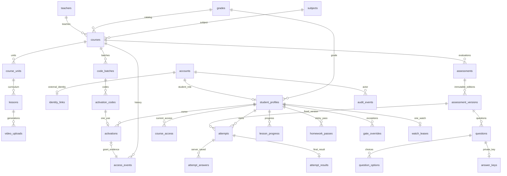

# F03 — تصميم بيانات المنصة

تاريخ التسليم: **2026-10-02**. أُعد مخطط من **28 جدولًا** وعلاقاته وقيوده، ومعه SQL قابل للمراجعة وتجربة معاملات للتفعيل والتجديد. نجحت **42 مجموعة تحقق** على PostgreSQL محلي 17.11 في قاعدة مؤقتة حُذفت بعد الاختبار. هذا إنجاز دفعة التصميم والتحقق المحلي؛ تطبيق المنصة وmigration المنتج ومصفوفة F04 لم تُنفذ في هذه الدفعة.

المراجع الحاكمة: [عقد F02](F02-state-contract.ar.md)، [أمثلة الانتقالات](F02-transition-examples.ar.md)، [D01–D28](../phase-1/decisions.ar.md)، [معايير القبول](../phase-1/acceptance-criteria.ar.md). ملفات التنفيذ التجريبي: [SQL المخطط](../../experiments/data-model/schema-draft.sql)، [معاملات التجربة](../../experiments/data-model/transaction-prototype.mjs)، [التحقق](../../experiments/data-model/verify-model.mjs)، [النتيجة الآلية](F03-validation-result.json). تفاصيل حدود العمليات في [عقد معاملات F03](F03-transactions.ar.md).

## العلاقات الرئيسية

الرسم يلخص العلاقات؛ المرجع الدقيق هو SQL. مثلًا المنح والتمديد والسحب كلها `access_events`، لكن أحداث الأكواد فقط ترتبط بتفعيل. التقييم المنطقي يظل نفسه عبر إصداراته. علاقة محاولة/نتيجة تصبح إلزامية عند التسليم فقط. لا يُحذف كيان مستخدم بتتابع `CASCADE`.

## الهوية والبيانات الأساسية — 6 جداول

| الجدول | المفتاح والحقول المهمة | العلاقة والقيد |
|---|---|---|
| `accounts` | UUID؛ `phone/full_name/role/status`؛ قفلا التجهيز والاستعادة؛ `auth_epoch` | رقم موحد فريد، شكل E.164؛ دوران `student/admin` فقط. حالة الحساب مستقلة عن اشتراكاته |
| `identity_links` | PK=`account_id`؛ `provider/external_subject` | هوية دخول واحدة للحساب حاليًا؛ `(provider, external_subject)` فريد؛ لا FK إلى `auth.users` ولا كلمة سر في مخطط التطبيق |
| `student_profiles` | PK=`account_id`؛ `grade_id` | FK مركب إلى حساب بدور طالب؛ يستحيل إلحاق ملف طالب بحساب أدمن |
| `grades` | UUID؛ اسم وترتيب فريد وإتاحة | الصفوف الفعلية تُجهز في بناء المشروع؛ صفوف اختبار F01 ليست قائمة منتج معتمدة |
| `subjects` | UUID؛ اسم فريد | مرجع مادة الكورس |
| `teachers` | UUID؛ اسم ونبذة ومرجع صورة وإتاحة | سجل مدرس دون هوية دخول؛ صفوفه ومواده المعروضة تُستخرج من كورساته المنشورة |

تطبيع الهاتف يتم في خدمة التسجيل بنفس قاعدة F01 قبل التخزين؛ فحص شكل الرقم وحده لا ينفذ التطبيع. فك قفل التجهيز يتطلب ملفًا وهوية مكتملين في مسار التسجيل المنسق. جداول جلسات Auth والاستعادة التشغيلية تُراجع عند دمج F01 مع التطبيق؛ مخطط F03 لا ينسخها ولا ينقل بياناتها. الربط المنفصل يسمح باستبدال مزود الهوية دون تغيير معرف الطالب أو تاريخه.

## المحتوى — 9 جداول

| الجدول | المفتاح والحقول المهمة | العلاقة والقيد |
|---|---|---|
| `courses` | UUID؛ مدرس/صف/مادة؛ عنوان ووصف؛ حالة ومواعيد نشر/أرشفة؛ بيئة تقديم | يبدأ مسودة ثم منشور ثم مؤرشف؛ لا رجوع غير معتمد. بيانات الهوية والبيئة تثبت بعد النشر |
| `course_units` | UUID؛ كورس وعنوان وترتيب | ترتيب وحدة فريد داخل الكورس؛ `(id,course_id)` هدف FK مركب |
| `lessons` | UUID؛ كورس ووحدة؛ ترتيب عام داخل الكورس؛ عنوان ووصف؛ نشر وأول استخدام؛ أصل فيديو حالي | الوحدة من نفس الكورس. المنشور/المستخدم لا يُحذف ولا يُعاد ترتيبه؛ التصحيح الشكلي متاح. نشر درس جديد يأتي بعد آخر درس منشور |
| `video_uploads` | UUID؛ درس و`generation/provider/library_id/provider_video_id`؛ معالجة/جاهز/فشل؛ مدة ومصدر تحقق | جيل فريد للدرس، وأصل المزود فريد. المؤشر الحالي يشير لأصل نفس الدرس؛ ملفات الفيديو خارج الجداول |
| `assessments` | UUID؛ كورس؛ نوع؛ درس للواجب أو وحدة اختيارية للامتحان؛ نسخة حالية | واجب منطقي واحد لكل درس. الوحدة/الدرس من نفس الكورس. معرف التقييم يجمع حد المحاولات عبر النسخ |
| `assessment_versions` | UUID؛ التقييم والكورس والنوع ورقم إصدار؛ مدة/عدد محاولات/نسبة/نافذة؛ نشر | الإصدار المنشور ثابت. الواجب: 70%، بلا حد محاولات أو مؤقت جديد. الامتحان: مدة وعدد موجبان ونافذة صحيحة |
| `questions` | UUID؛ إصدار وترتيب ونص ودرجة `numeric` | درجة موجبة، لا `NaN`؛ الترتيب فريد بالإصدار |
| `question_options` | UUID؛ إصدار وسؤال وترتيب ونص | الخيار من سؤال نفس الإصدار؛ ترتيب 1–6، والنشر يشترط 2–6 خيارات لكل سؤال |
| `answer_keys` | PK=`version_id,question_id`؛ خيار صحيح وشرح | صحيح واحد من خيارات نفس السؤال والإصدار؛ لا يندمج في إسقاط الأسئلة المرسل للطالب |

نشر نسخة تقييم يتطلب سؤالًا واحدًا على الأقل، خيارات صالحة، ومفتاحًا لكل سؤال. تعديل المنشور ينشئ نسخة جديدة؛ تمنع triggers تعديل/إضافة/حذف محتوى النسخة المنشورة. اختيار النسخة الحالية لا ينقل المحاولات القديمة إليها.

`delivery_environment=development` هو الافتراضي في هذه المسودة فقط لتجارب الفيديو المحلية. درس تقديم حي لا ينشر بفيديو `fixture`. الانتقال إلى بيانات المنتج الحية يتطلب أصل Bunny مؤكدًا ومراجعة النشر الكاملة، ولا يتحقق بمجرد تغيير اسم البيئة. لم تُفعل Bunny؛ الحقول تمهد لربطها لاحقًا.

قيد SQL للفيديو يفحص الجاهزية عند نشر الدرس. صلاحية كل تقييم تابع، تحقق المزود الحقيقي، تجاهل callback لرفع قديم، ومنع تغيير أصل مستخدم عبر مسار غير معتمد مسؤوليات معاملة المحتوى لاحقًا؛ هذه الدفعة لا تنفذ API فيديو أو محرر تقييمات.

## الأكواد والوصول — 5 جداول

| الجدول | المفتاح والحقول المهمة | العلاقة والقيد |
|---|---|---|
| `code_batches` | UUID؛ كورس؛ 30/60/90؛ عدد؛ آخر تفعيل اختياري؛ أدمن منشئ؛ `request_id/request_digest` | `(created_by,request_id)` فريد؛ الدفعة ثابتة بعد توليدها. تحقق العدد الفعلي وإعادة نفس الطلب بنفس محتواه مسؤولية معاملة التوليد |
| `activation_codes` | UUID؛ دفعة وكورس ومدة؛ `code_digest`؛ نسخة تصدير مشفرة ومعرف مفتاح؛ لاحقة مخفية؛ بيانات إلغاء | الكورس والمدة مطابقان للدفعة بـFK مركب؛ digest فريد؛ لا كود كامل كنص. الوجهة والمدة ثابتتان، والإلغاء لا يلغى ولا يقع بعد الاستخدام |
| `activations` | UUID؛ كود واحد؛ طالب؛ كورس ومدة؛ وقت؛ سند منح | `code_id` فريد، المالك والسند ثابتان؛ FK يثبت تطابق الكورس والمدة مع الكود. عند commit يجب وجود حدث المنح المطابق والوصول الحالي |
| `access_events` | UUID؛ طالب وكورس و`epoch`؛ نوع؛ تفعيل/فاعل/عملية/سبب؛ أيام ووقت وبداية ونهاية | سجل ثابت للمنح والتجديد والرجوع والتمديد والسحب؛ FK عكسي يربط حدث الكود بتفعيله المحدد. السحب/التمديد بسند وسبب |
| `course_access` | PK=`student_id,course_id`؛ `epoch/started_at/access_until/withdrawn_at/last_event_id` | صف واحد للوصول الحالي، مرتبط بسند لنفس الطالب والكورس والجيل؛ الانتهاء مشتق من الوقت |

حالة الكود تعرض `used` عند وجود تفعيل، ثم `cancelled` عند وجود إلغاء، وإلا `available`. انتهاء آخر تفعيل وصف مشتق إضافي. هذا يمنع ازدواج حالة «مستخدم» مع جدول الملكية. لا تسترجع الملكية ولا تُنقل لطالب آخر.

`epoch` يميز أجيال المنح: التجديد الساري بكود يبقيه، والكود الذي يعيد الوصول بعد السحب أو الانتهاء يبدأ جيلًا جديدًا. تمديد الدعم يبقي جيل المنحة غير المسحوبة، حتى إن انتهى وقتها، ويسجل حدث التمديد ووقته؛ لا يمنح محتوى بأثر رجعي أثناء الانقطاع. انتهاء الوقت لا يمحو الصف القديم؛ العملية الجديدة تترك سنده ثابتًا وتحدث الصف الحالي. التجديد الساري يضيف بعد النهاية الحالية، والمنتهي يبدأ الآن، والمسحوب يبدأ الآن أيضًا. الكود القديم يعيد أثره التاريخي مع الحالة الحالية ولا يزيل السحب — D28.

توليد الكود الحقيقي وتشفير التصدير ليسا منفذين هنا: التصميم يفترض سرًا عشوائيًا عالي العشوائية، HMAC-SHA256 للبحث، ونسخة تصدير مشفرة بمفتاح خارج البيانات. `encryption_key_id` مرجع للمفتاح وليس المفتاح نفسه. fixtures تستخدم bytes تجريبية واضحة؛ لا تمثل مولدًا أو تشفيرًا صالحًا للبيع.

## التعلم والتاريخ — 8 جداول

| الجدول | المفتاح والحقول المهمة | العلاقة والقيد |
|---|---|---|
| `attempts` | UUID؛ طالب وتقييم وإصدار وكورس ونوع؛ رقم؛ حالة؛ بدء/موعد/تسليم؛ معرف نتيجة | محاولة جارية واحدة للطالب والتقييم عبر الإصدارات؛ رقم محاولة فريد على التقييم المنطقي. هوية المحاولة ومؤقتها ثابتان، والمسلمة ثابتة |
| `attempt_answers` | PK=`attempt_id,question_id`؛ الإصدار والخيار؛ revision ووقت استقبال | FK يربط المحاولة بإصدارها والخيار بسؤال الإصدار نفسه؛ revision يتقدم؛ الخادم يثبت وقت الاستقبال بعد القفل؛ لا كتابة عند/بعد الموعد أو بعد التسليم. مسح اختيار يتم بقيمة NULL وإصدار جديد |
| `attempt_results` | PK=`attempt_id`؛ درجة فعلية/كلية ونجاح ووقت | نتيجة نهائية واحدة ثابتة، درجات داخل الحدود؛ FK مؤجل يضمن محاولة مسلمة، وFK عكسي يمنع تسليمًا بلا نتيجة |
| `lesson_progress` | PK=`student_id,lesson_id`؛ موضع وإكمال وrevision | الموضع لا يكمل الدرس؛ الإكمال المسجل لا يُمسح؛ تاريخ درس ثابت دون ربطه بكود معين |
| `homework_passes` | PK=`student_id,assessment_id`؛ أول محاولة نجاح ووقت | محاولة واجب لنفس الطالب والتقييم والكورس، بنتيجة مسلمة ودرجة فعلية ≥70%. نجاح ثابت دون تقريب أو تبديل سند |
| `gate_overrides` | PK=`student_id,lesson_id`؛ أدمن وسبب ووقت وعملية | تجاوز ثابت للدرس المستهدف فقط؛ لا اشتراك أو تعديل درجة |
| `watch_leases` | PK=`student_id`؛ درس وجيل؛ digest جهاز وتوكن؛ اقتناء/نبض/انتهاء | مشاهدة واحدة عبر الكورسات؛ نقل الجهاز يحدث الصف ويرفع الجيل. مدة lease وتصرف المزود ينفذان في مرحلة الفيديو |
| `audit_events` | UUID؛ فاعل/فعل/نوع هدف/معرف/عملية/سبب/وقت | سجل ثابت، أثر العملية المحدد فريد؛ هدف متعدد الأنواع يراجع في الخدمة، وفاعل حساب بـFK؛ لا payload مفتوح للأسرار |

التصحيح الفعلي يحسب الدرجة من مفاتيح إصدار المحاولة ثم نسبة النجاح دون تقريب. SQL يضمن حدود الأرقام وثبات النتيجة، لكنه ليس مصححًا تلقائيًا. تثبيت درجة اختبار داخل helper لا يثبت صحة التصحيح. إتاحة الصحيح والشرح D14 تحسم في الخادم؛ فصل الجدول يساعد على إرسال الحقول المسموحة فقط.

عدد المحاولات المتبقية يُحسب على التقييم المنطقي تحت القفل؛ فريدة رقم المحاولة وحدها لا تفرض `max_attempts`. اكتمال الواجب قبل تسليمه، نافذة بدء الامتحان، التسليم التلقائي، واستثناء استكمال امتحان بعد انتهاء الوصول تُنفذ حسب [عقد المعاملات](F03-transactions.ar.md).

## الوقت والقيود وصلاحيات البناء

كل المواعيد `timestamptz`، والعرض بالقاهرة. حساب 30/60/90 يستخدم ثواني اليوم ×86400، لا `interval '1 month'` ولا أيامًا بالتوقيت المحلي. الأصل هو ساعة PostgreSQL بعد اكتساب أقفال العملية. يحتفظ runner بدقة microseconds بدل تحويل تواريخ البيانات إلى JavaScript Date.

المفاتيح UUID، وFK مركبة تمنع خلط كورس/وحدة/درس أو تقييم/إصدار أو سؤال/خيار. يوجد index يبدأ بأول عمود لكل FK، بجانب فهارس الاكتشاف والتاريخ والمحاولات المستحقة؛ الفهارس الجزئية لا تحل محل فهرس FK الشامل. حدود الصفوف في CHECK، والوحدانية في UNIQUE، والترابط في FK، والثبات والنشر في triggers، وقرارات الحالة الحية والوقت والعدد في المعاملة. لا CHECK يعتمد على `now()` أو حالة جدول آخر: هذه الحدود تختلف مع الوقت أو العمليات. [مرجع قيود PostgreSQL 17](https://www.postgresql.org/docs/17/ddl-constraints.html).

المخطط `app_private`، دون منح عامة أو أدوار دخول جديدة. كل الجداول RLS مفعل ومفروض، دون سياسات تشغيل في هذه المسودة. لا يضاف المخطط لقائمة Data API المكشوفة. F04 يحدد أدوار الخادم ومداخل العمليات وإسقاطات القراءة والصلاحيات؛ تشغيل تجربة SQL بدور PostgreSQL الإداري لا يثبت رفض عمليات HTTP لطالب آخر. [وثائق صلاحيات Supabase](https://supabase.com/docs/guides/api/securing-your-api)، [المخططات المخصصة](https://supabase.com/docs/guides/api/using-custom-schemas).

## نتيجة التحقق وحدود التسليم

| النطاق | الدليل الفعلي |
|---|---|
| المخطط | تطبيق SQL في قاعدة جديدة، 28 جدولًا، وعدم وجود FK بلا index يبدأ بعموده الأول |
| التفعيل | كورس غير مؤكد/كود منتهي مرفوضان، لا تفعيل بلا سند عند commit، وفشل محقون يرجع التفعيل والوصول والـaudit كلها |
| التزامن | طالبان لكود واحد، كودان لتجديد نفس الوصول، انتظار قفل ثم إلغاء/تعطيل/أرشفة تسبق التفعيل، وعاملان للتسليم بنتيجة واحدة |
| التاريخ | إعادة كود المالك لا تزيد أيامًا، القديم لا يزيل السحب، جديد D28 يبدأ 30×24 ساعة ويحفظ السحب القديم، تمديد لا يفك تعطيل الحساب |
| المحتوى والتقييم | تطابق العلاقات، جاهزية فيديو، رفض fixture للنشر الحي، ثبات المنشور، نسخة محاولة ثابتة، رفض revision قديم وإجابة بعد الموعد |
| التعلم | أول نجاح واجب ثابت، 69.9% مرفوضة لفتح التالي، إكمال بالزر مستقل عن موضع الفيديو، مشاهدة واحدة للطالب |
| التنظيف | حذف قاعدة الاختبار المملوكة لهذا التشغيل فقط؛ تعداد صفوف Auth وجداول F01 قبل/بعد مطابق |

النتيجة الآلية: **42/42**، `cleanup=true` و`existingStackUnchanged=true`. الحقل الأخير يتحقق من تعداد صفوف تجربة F01 وAuth قبل/بعد؛ ليس تدقيقًا لكل إعداد خدمة. لا إعادة لاختبارات الحماية السابقة، ولا اتصال Bunny أو مشروع سحابي أو دفع.

العاملان في اختبار التسليم يستخدمان helper يدويًا بنتيجة fixture؛ لم يُنفذ scheduler التسليم التلقائي ولا اختُبر browser/API. اختبار uniqueness الطلب لا ينفذ توليد CSV أو مقارنة payload إعادة الطلب. اختبار lease يثبت صفًا واحدًا، ولا يثبت توقف بث المزود القديم. جميع مسارات F02 لها موضع في المخطط وعقد المعاملات؛ ليست كلها منفذة في هذه التجربة.

الخطوة التالية المنفصلة **F04: مصفوفة صلاحيات الوظائف وترجمة مداخل الخادم والبيانات**. إنتاج migration من هذا التصميم ودمج الهوية والواجهات يأتيان ضمن دفعات البناء المعتمدة لاحقًا. تهيئة حماية الاستضافة وقرار مزود Auth الإنتاجي وفحص الفيديو الحقيقي تبقى قبل الإتاحة للطلاب وفق الاتفاق.
