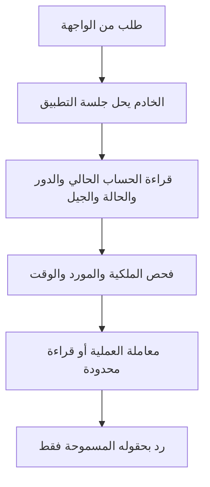

# F04 — صلاحيات الوظائف ومداخل البيانات

تاريخ التسليم: **2026-10-02**. أُعد عقد **48 عملية** للزائر والطالب والأدمن والعامل الداخلي، مرتبط بالـ34 انتقالًا في F02، ومصفوفة CRUD للـ28 جدولًا. نُفذت قواعد أهلية قابلة للتشغيل وإسقاطات حقول الرد، وprototype SQL لقراءة تاريخ الطالب وحده. نجحت **24/24 مجموعة تحقق محلية** في قاعدة ودور مؤقتين حُذفا. الناتج أساس للمشروع F05؛ ليس تطبيق HTTP منشورًا أو إغلاقًا لقبول Auth الإنتاجي.

المراجع: [قرارات المنتج](../phase-1/decisions.ar.md)، [معايير القبول](../phase-1/acceptance-criteria.ar.md)، [حالات F02](F02-state-contract.ar.md)، [مخطط F03](F03-data-model.ar.md)، [عقد معاملات F03](F03-transactions.ar.md). التنفيذ: [عقد العمليات والحقول](../../experiments/permissions/permission-contract.mjs)، [قواعد الأهلية](../../experiments/permissions/authorize.mjs)، [صلاحيات القراءة التجريبية](../../experiments/permissions/read-permissions-draft.sql)، [التحقق](../../experiments/permissions/verify-permissions.mjs)، [نتيجة التشغيل](F04-validation-result.json).

## مصدر الفاعل وحد العملية

الواجهة ترسل معرّف المورد والمدخلات المسموحة، والخادم يحدد اسم العملية من handler ثابت. `role/actorId/studentId/authEpoch` المرسلة لا تختار الفاعل أو صلاحياته. بعض أوامر الأدمن تحتاج `studentId` **كهدف**؛ يظل الفاعل هو الأدمن صاحب الجلسة. قوائم الطالب تستخدم هوية الجلسة في WHERE؛ طلب مورد بملكية طالب آخر يعيد رفضًا عامًا دون بيانات المالك.

عقد `resolveSession` يتوقع جلسة تحقق منها الخادم، غير منتهية أو ملغاة، مرتبطة بحساب التطبيق وauth_epoch. ربط هذه الجلسة الفعلي بـF01 وcookie التطبيق يتم أثناء بناء الحسابات. في التجربة يحل adapter رموزًا عشوائية إلى fixtures محفوظة في ذاكرة الخادم؛ لا تحقق JWT أو cookie أو مزود خارجي ضمن F04. `loadAccount/loadResource/clock` dependencies موثوقة للخادم، وليست حقولًا من body.

الدور من حساب التطبيق الحي؛ لا يعتمد على `user_metadata` أو ادعاء دور في token قديم. يجب أن يطابق auth_epoch الجلسة، وأن يكون الحساب نشطًا ومكتمل التجهيز وغير مقفول للاستعادة. هذه الشروط تسري على قراءة تاريخ الطالب أيضًا. الأدمن لا يحصل على حالة نشاط بمجرد اختيار صفحة الإدارة.

أي كتابة تستدعي قواعد الأهلية **داخل معاملة F03 نفسها** بعد أقفال الحساب والموارد، ثم تستخدم حقول الأمر المحددة فقط. لا تكتب بالخادم اعتمادًا على permit قديم أو على زر مفعّل في الواجهة. prototype تصحيح عنوان الكورس يراجع الأدمن داخل المعاملة، يكتب العنوان فقط، ويسجل actor الحقيقي في audit. التحقق الكامل من المحتوى والأعداد والتصحيح وتنسيق المزود يظل في خدمات المراحل المعنية.

## مصفوفة العمليات — 48 عملية

الأسماء IDs داخلية وليست URLs نهائية. «مسموح» يعني قبول أهلية العملية ثم تنفيذ شروط نطاقها في F03 والخدمة؛ ليس GRANT خامًا للمتصفح.

| العملية | الفاعل المسموح | النطاق والشروط أو أثرها |
|---|---|---|
| `catalog.list` | زائر | مدرسون/صفوف/مواد وكورسات منشورة؛ SELECT وإسقاط بيانات عامة فقط، لا مسودات أو سجل طالب |
| `catalog.detail` | زائر | كورس منشور، تعريف ومنهج منشور بعناوينه؛ دون تشغيل أو أسئلة |
| `auth.register` | مسار F01 | الاسم/الصف/الموبايل/الكلمة، دور طالب يثبته الخادم؛ لا إنشاء أدمن من الواجهة |
| `auth.login` | مسار F01 | بيانات الدخول إلى خدمة الحسابات؛ تطبيق حالتها الحية قبل منح مسارات المنصة |
| `auth.logout` | مسار F01 | إبطال الجلسة المعنية؛ متاح للخروج حتى عند منع عمليات الحساب المحمية |
| `student.profile` | طالب نشط | ملف صاحب الجلسة فقط، لا حقول دور أو auth_epoch أو هوية مزود في الرد |
| `student.courses` | طالب نشط | وصوله الحالي والتاريخي؛ كورس منشور أو مؤرشف سبق تفعيله، وإظهار الانتهاء والسحب من الحالة الحية |
| `student.progressHistory` | طالب نشط | تقدمه فقط؛ لا يشترط اشتراكًا ساريًا |
| `code.preview` | طالب نشط | بيانات الكورس المرتبط المحدودة قبل التأكيد؛ مستخدم الآخر يرفض دون هوية مالكه |
| `code.activate` | طالب نشط | كورس مؤكد مطابق وكود جديد صالح لكورس منشور؛ إعادة كوده المستخدم تعيد السابق حتى بعد الأرشفة، دون أيام أو فك سحب |
| `video.open` | طالب نشط | وصول ساري غير مسحوب، درس منشور مفتوح وفيديو جاهز؛ إصدار lease وتشغيل من adapter موثوق |
| `video.heartbeat` | طالب نشط | شروط المشاهدة مع مطابقة توكن/جيل lease الحالي؛ لا تجديد من الجهاز المنقول منه |
| `lesson.position` | طالب نشط | درس متاح له؛ حفظ موضعه بإصدار متقدم دون إعلان إكمال |
| `lesson.complete` | طالب نشط | درس متاح له؛ تثبيت الإكمال مرة واحدة دون فتح الواجب التالي تلقائيًا |
| `assessment.read` | طالب نشط | تقييم منشور لنفس كورس الدرس المتاح؛ **تعليمات وإعدادات فقط**؛ الأسئلة من محاولة مقبولة ثابتة النسخة |
| `attempt.start` | طالب نشط | وصول ساري ودرس مفتوح وتقييم منشور؛ نافذة وعداد منطقي صالحان. الواجب غير محدود، والامتحان بحده؛ بدء/إعادة محاولة جارية وفق F03 |
| `attempt.resume` | طالب نشط | محاولة مملوكة جارية قبل موعدها؛ الامتحان الذي بدأ صالحًا يستكمل بعد انتهاء الوصول، والواجب يحتاج وصولًا ساريًا |
| `attempt.answer` | طالب نشط | نفس شروط استئناف المحاولة، خيار من نسختها وrevision أحدث؛ الوقت المعتمد من الخادم |
| `attempt.submit` | طالب نشط | تسليم محاولته مرة واحدة وفق F03؛ المسلمة تعيد النتيجة بلا تغيير ولو انتهى/سُحب الوصول. لا تعرض keys قبل شرط النموذج |
| `result.read` | طالب نشط | نتيجة محاولته المسلمة، دون اشتراك ساري؛ لا مفاتيح صحيح تلقائيًا |
| `result.model` | طالب نشط | نسخة **محاولته** المسلمة؛ بعد نهاية الامتحان الموحدة، أو استنفاد المحاولات إن لا نهاية موحدة؛ ملكية ونشاط حساب مطلوبان |
| `admin.catalogManage` | أدمن نشط | إدارة صفوف/مواد/مدرسين، منع حذف مرجع مستخدم؛ المدرس سجل دون حساب دخول |
| `admin.courseSave` | أدمن نشط | إنشاء وحفظ مسودة ببياناتها وعلاقاتها الصالحة |
| `admin.coursePublish` | أدمن نشط | نشر المحتوى المختار الجاهز وتقييماته وفق F03؛ fixture لا ينشر للبيع |
| `admin.courseArchive` | أدمن نشط | منشور→مؤرشف وأثر مسجل؛ الوصول السابق محفوظ |
| `admin.lessonAppend` | أدمن نشط | إضافة جاهزة في نهاية المنهج، دون تحريك درس مستخدم |
| `admin.courseCosmetic` | أدمن نشط | title/description المسموحان، دون تغيير هوية كورس أو محتوى تقييم قديم |
| `admin.lessonDraftEdit` | أدمن نشط | مسودة غير مستخدمة بلا مراجع؛ تعديل/حذف ضمن ضوابط F03. غياب المورد أو وقائع الأهلية يرفض |
| `admin.videoSubmit` | أدمن نشط | بدء جيل رفع/معالجة مرتبط بدرس عبر adapter |
| `admin.videoRetry` | أدمن نشط | جيل جديد لإعادة معالجة/رفع؛ لا أصل جديد يبدل تاريخ درس مستخدم بصمت |
| `admin.assessmentDraft` | أدمن نشط | إنشاء أو تحرير إصدار مسودة، لا تعديل إصدار منشور |
| `admin.assessmentPublish` | أدمن نشط | فحص نسخة كاملة ونشرها وتحديث المؤشر؛ المحاولات القديمة لا تنقل إليها |
| `admin.codesGenerate` | أدمن نشط | دفعة لكورس ومدة 30/60/90 وعدد محددين، مع مفتاح طلب ومقارنة محتواه |
| `admin.codesList` | أدمن نشط | بيانات دفعات وحالات واستخدامات؛ قائمة اعتيادية تخفي السر الكامل |
| `admin.codesExport` | أدمن نشط | فك تصدير الدفعة المسموح على الخادم، CSV مضبوط وأثر؛ مفتاح التشفير لا يخرج |
| `admin.codeCancel` | أدمن نشط | غير المستخدم فقط، تأكيد الإلغاء وفاعل وتاريخ وسبب إجراء مسجل بالخادم؛ إلغاء واحد ثابت، دون فرض حقل شرح جديد في الواجهة |
| `admin.studentList` | أدمن نشط | معلومات الطلاب التشغيلية المسموحة؛ لا كلمات سر أو raw sessions |
| `admin.studentRead` | أدمن نشط | طالب محدد واشتراكاته وتقدمه ونتائجه للدعم؛ ليس هوية الدخول الخارجية أو أسرار الأكواد |
| `admin.studentDisable` | أدمن نشط | طالب مستهدف وسبب وaudit؛ لا تعديل لمواعيد اشتراكه |
| `admin.studentEnable` | أدمن نشط | طالب مستهدف وإجراء مسجل؛ لا إلغاء سحب أو أيام تعويض تلقائية |
| `admin.studentRecover` | أدمن نشط | طالب وتحقق حضوري مسجل ومرجع/سبب؛ تنسيق F01، لا قراءة كلمة السر القديمة |
| `admin.accessWithdraw` | أدمن نشط | وصول سابق لطالب وكورس وسبب؛ سحب بسند مستقل |
| `admin.accessExtend` | أدمن نشط | وصول سابق غير مسحوب ومدة موجبة وسبب؛ يمكن تعويض المعطل دون فك تعطيله |
| `admin.lessonOverride` | أدمن نشط | طالب ودرس مستهدف وسبب؛ تجاوز بوابة الواجب فقط |
| `admin.settings` | أدمن نشط | الاسم ووسيلة دعم السنتر والحقول المعتمدة فقط؛ ليست إعدادات مفاتيح المزود من المتصفح |
| `admin.audit` | أدمن نشط | قراءة سجل الإجراء ومرجع الفاعل/الهدف/السبب؛ لا تعديل أو حذف الأحداث |
| `internal.autosubmit` | عامل خادم | محاولة جارية بلغ موعدها، آخر إجابات مؤكدة وتصحيح نهائي واحد؛ لا توقف بسبب تعطيل/سحب حدث بعد حفظها |
| `internal.videoStatus` | adapter موثوق | مصدر مزود تحقق منه adapter وجيل الرفع الحالي فقط؛ callback قديم لا يعلن الجاهزية |

مسارات `auth.*` تفوض إلى F01 بدل المرور بقواعد الطالب التي تفترض اكتمال الجلسة. `internal.*` لا يقبلها authorizer الطلبات البشرية حتى لو كان المتصل أدمنًا. closures العامل الداخلي تُنشأ من تهيئة الخادم بمداخلها المحددة؛ endpoint لا يحول body مثل `providerVerified=true` إلى مصدر موثوق.

`result.model` هنا للامتحان وفق D14؛ لا يقرر إضافة كشف نموذج واجب جديد. قراءة تعليمات تقييم لا تمنح أسئلته؛ أسئلة محاولة الامتحان تقدم بعد M01 ومن نسخة المحاولة في M05، ومفاتيحها لا تُقرأ ثم تُخفى في الواجهة. نموذج سمح للطالب بقراءته لا يعاد إخفاؤه بتغيير غير معتمد في سياسة الإصدار.

## مصفوفة CRUD على 28 جدولًا

R قراءة، C إنشاء، U تعديل، D حذف. جميع الحقوق أدناه **من خلال أوامر/قراءات الخادم المحددة**؛ الزائر والطالب والأدمن في المتصفح ليسوا أدوار اتصال قاعدة البيانات. الكتابات التي تغير الاشتراك والدرجة والهوية تختار قيمها من حسابات الخادم والساعة والأسئلة، لا من حقول الطالب.

| الجدول | قراءة عامة | الطالب عبر الخادم | الأدمن/الخدمة وحد الكتابة |
|---|---|---|---|
| `grades` | المتاح للتسجيل والفلاتر | R الاسم/صفه | أدمن C/R/U، D غير مرتبط فقط |
| `subjects` | المرتبط بالاكتشاف | R عرض | أدمن C/R/U، D غير مرتبط فقط |
| `teachers` | حقول عرض المدرس صاحب كورسات منشورة | R العرض/مدرس كورسه السابق | أدمن C/R/U، D غير مرتبط فقط؛ لا صلاحية حساب مدرس |
| `accounts` | لا | R ملفه المسموح؛ C تسجيل طالب عبر F01 | تسجيل موثوق C، دعم U حالة/قفل/جيل/بيانات مسار معتمد؛ الدور لا يحرر من الواجهة، D تاريخ مستخدم ممنوع |
| `identity_links` | لا | لا raw CRUD | adapter الهوية C/R، U ربط منسق عند الحاجة فقط؛ لا مرجع مزود في رد طالب |
| `student_profiles` | لا | R صفه؛ C ضمن التسجيل | تسجيل موثوق C، تصحيح بيانات دعم معتمد U؛ ملكية ودور من الحساب، لا حذف تاريخ مستخدم |
| `courses` | R منشور وحقول عامة | R كورساته السابقة حتى المؤرشف | أدمن C/R/U أوامر مسودة/نشر/تصحيح/أرشفة؛ لا D كبديل للأرشفة |
| `course_units` | R عناوين منهج منشور | R منهجه المتاح | أدمن C/R/U، D مسودة غير مرتبطة فقط؛ ترتيب مستخدم ثابت |
| `lessons` | R بيانات منهج منشور | R المنشور، U تقدم في جدوله المنفصل | أدمن C/R/U/D وفق مسودة غير مستخدمة؛ لا حذف/تحريك المنشور أو المستخدم |
| `video_uploads` | لا | لا raw CRUD | adapter وأدمن عبره C/R/U حالات وأجيال؛ لا أصول أو مفاتيح تشغيل في قائمة عامة |
| `assessments` | بيانات تعريف معتمدة فقط | R التعليمات، بعد أهلية الدرس | أدمن C/R/U؛ لا تغيير علاقة تقييم مستخدم أو حذف تاريخه |
| `assessment_versions` | لا إعدادات محمية خام | R إعدادات/أسئلة الإصدار المسموح | أدمن C/R/U/D مسودة فقط؛ المنشور ثابت |
| `questions` | لا | R نسخة محاولة مصرح بها | أدمن C/R/U/D مسودة فقط؛ التصحيح يقرأ ثابت النسخة |
| `question_options` | لا | R خيارات أسئلة نسخته دون الصحيح | أدمن C/R/U/D مسودة فقط |
| `answer_keys` | لا | R فقط بعد `result.model` وبنسخة محاولته | أدمن C/R/U/D مسودة، مصحح R؛ ليس ضمن payload السؤال |
| `code_batches` | لا | لا raw CRUD | أمر أدمن C/R، تصدير محدود؛ لا U/D لدفعة مولدة |
| `activation_codes` | لا | إدخال السر لا يعطي R للجدول؛ عرض محدود للكورس/الحالة | أمر توليد C، أدمن R محدود/تصدير خاص، U إلغاء فقط؛ لا D أو تحويل كود مستخدم |
| `activations` | لا | R أثر تفعيله المحدود | خدمة التفعيل C ذرية، أدمن R؛ لا U/D أو نقل مالك |
| `access_events` | لا | R تاريخ وصوله المحدود | خدمات تفعيل/دعم C، أدمن R؛ لا U/D |
| `course_access` | لا | R حالته، بلا U تاريخ نهاية | تفعيل/دعم C/U بمعاملة وسند؛ أدمن R، لا D تاريخ |
| `attempts` | لا | C بدء/U تسليم من خلال أمر، R محاولته حسب قواعدها | مصحح/عامل U إنهاء، أدمن R دعم؛ لا D أو إعادة رقم محاولات |
| `attempt_answers` | لا | C/U إجابة محاولته بإصدار، R استئناف | الحفظ والتصحيح من الخدمة؛ لا D لمسح الإجابة، NULL بإصدار جديد بدلًا منه |
| `attempt_results` | لا | R نتيجته المسلمة | المصحح C وحيد، أدمن R؛ لا U/D، والطالب لا يكتب passed/points |
| `lesson_progress` | لا | C/U موضع/زر إكمال عبر أمر، R تاريخه | خدمة التقدم تضبط المالك والوقت/revision، أدمن R؛ لا D أو فك إكمال مسجل |
| `homework_passes` | لا | R حالة فتح مشتقة | المصحح C أول نجاح حقيقي، أدمن R؛ لا U/D من الطالب أو الدعم |
| `gate_overrides` | لا | R حالة التجاوز له | أمر دعم C لدرس/طالب/سبب، أدمن R؛ لا U/D أو جعل التجاوز اشتراكًا |
| `watch_leases` | لا | طلب مشاهدة/نبض، دون R hashes الخام | adapter مشاهدة C/U بعد أهلية الحساب/الوصول، R داخلي؛ انتهاء lease مشتق |
| `audit_events` | لا | لا raw CRUD | الخدمات C، أدمن R؛ لا U/D؛ لا passwords/full codes/JWT/play URLs |

U لبيانات حساب/صف أو ربط هوية غير موجود في مسار معتمد لا يصبح endpoint بمجرد هذه المصفوفة. إنشاء أدمن أول/إدارة مفاتيح المزود تهيئة خادم موثوقة خارج واجهة MVP؛ لا عملية ترقية طالب لأدمن. إعدادات السنتر لا تحتاج جدولًا مفتوحًا عامًا جديدًا في F04؛ مخزنها النهائي يحدد عند البناء.

## ترجمة حدود البيانات

| مسار البيانات | حد الخادم | ترجمة قاعدة البيانات وحالة التنفيذ |
|---|---|---|
| اكتشاف عام | WHERE منشور وإسقاط metadata | تصميم قراءة محدودة دون tables/keys في Data API؛ endpoint الاكتشاف يبنى في المرحلة 3 |
| تاريخ الطالب | هوية الجلسة + حساب حي + ملكية | **منفذ تجريبيًا:** NOLOGIN/NOBYPASSRLS reader، SELECT أعمدة محددة على 6 جداول، 6 سياسات ملكية/حالة، 4 views بـsecurity_invoker |
| تعلم وأسئلة ونموذج | أهلية الموارد والوقت ثم نسخة المحاولة وإسقاطها | guards وإسقاطات منفذة؛ استعلامات/handlers التعلم والمصحح وخدمة النموذج تنفذ في المراحل 6–7؛ reader التاريخ لا يقرأ keys/questions |
| كتابة الطالب | هوية وساعة وملكية من الخادم؛ F03 transaction | قواعد أهلية منفذة؛ أوامر التفعيل والتقدم والمحاولات تنفذ في المراحل 5–7، دون GRANT DML مباشر للطالب |
| إدارة ودعم | دور حي، هدف وسبب وDTO ضيق، audit | قواعد أهلية ومثال تصحيح عنوان/audit منفذان؛ مداخل CRUD والأكواد والدعم كلها typed commands عند بناء وحداتها |
| جداول الهوية | adapter F01 فقط | لا GRANT للمتصفح؛ التسجيل والاستعادة لهما مراحل تنسيق مزود معروفة، والدمج الفعلي لاحق |
| عامل تصحيح/مزود | closure داخلية/adapter تحقق مصدره | أهلية داخلية منفذة؛ scheduler وتصحيح MCQ وBunny الحقيقي غير منفذة في F04 |

الدور التجريبي لا يملك LOGIN أو BYPASSRLS أو عضوية في أدوار أخرى أو كتابة جداول. يقرأ profile/access/progress/results لصاحب سياق الخادم فقط؛ انتهاء/سحب الاشتراك لا يمنع قراءة التاريخ، والتعطيل/قفل التجهيز/الاستعادة أو auth_epoch غير مطابق يجعل القراءة فارغة. views لا تتجاوز صلاحيات مستدعيها. [مرجع PostgreSQL 17 للـviews](https://www.postgresql.org/docs/17/sql-createview.html).

الخادم يضبط `app.actor_id/app.auth_epoch` بـ`set_config(..., true)` و`SET LOCAL ROLE` داخل transaction بعد تحقق الجلسة. لا تسرب scope إلى الاتصال المعاد استخدامه. هذه الإعدادات **سياق بيانات موثوق وليست آلية إثبات هوية مستقلة**؛ أي خدمة تتيح SQL أو تنسخ هذه القيم من headers/body تلغي هذا الحد. role/schema تظلان للخادم ولا تمنحان للـanon/authenticated. الربط بمزود الهوية الإنتاجي ما زال مطلوبًا.

كل جداول F03 خاصة وRLS مفعل ومفروض. GRANT يحدد الكائنات المتاحة، وRLS يحدد صفوفها؛ لا تمنح service_role للمتصفح أو تضيف هذه schemas لقائمة Data API المكشوفة. قواعد القراءة التجريبية لا تمنح أي كتابة تلقائية. [وثائق صلاحيات Supabase](https://supabase.com/docs/guides/api/securing-your-api)، [وثائق RLS](https://supabase.com/docs/guides/database/postgres/row-level-security).

أدوار الكتابة النهائية وفصل صلاحيات وحدات الهوية/المحتوى/التفعيل/التصحيح/الدعم/المشاهدة تُطبق مع أوامر وحداتها ومهاجرات المشروع. F04 لا يجهز role عامًّا للواجهة يكتب 28 جدولًا، ولا يقدم SQL تجريبيًا بصلاحيات postgres كمزود بيانات منتج. الدور الإداري المستخدم لتجهيز fixtures والتحقق محلي فقط.

## إسقاطات الرد وربط الواجهات

`project` يأخذ نوعًا ثابتًا من handler معتمد، لا `projection` يختاره العميل. لا يحل وحده محل الأهلية؛ التنفيذ يحل الجلسة ثم يفحص المورد ثم يقرأ أعمدته المسموحة ويصوغ الرد. لكل collection إسقاط على كل عنصر؛ arrays ومعلومات مزود مضمنة لا تسلسل تلقائيًا.

| شاشة/وظيفة | العمليات التي تربط بها عند البناء | البيانات والحد |
|---|---|---|
| الدخول والتسجيل | `auth.register`, `auth.login`, `auth.logout` | F01؛ لا localStorage كمرجع دور أو owner |
| الرئيسية/المدرسون/الكورس | `catalog.list`, `catalog.detail` | عناوين ونبذة وصور وصف ومادة ودروس منشورة؛ لا video IDs أو keys |
| حسابي/كورساتي | `student.profile`, `student.courses` | بيانات صاحب الحساب، بداية/نهاية/سحب؛ مصدر الوقت الخادم |
| شاشة التفعيل | `code.preview`, `code.activate` | عرض الكورس والتأكيد؛ لا مالك آخر/سر كامل في تاريخ الكود |
| المشغل والمنهج | `video.open`, `video.heartbeat`, `lesson.position`, `lesson.complete` | تصريح تشغيل قصير من adapter، حفظ منفصل عن الإكمال؛ لا توقيع أو hashes في payload |
| التعليمات والمحاولة | `assessment.read`, `attempt.start`, `attempt.resume`, `attempt.answer`, `attempt.submit` | التعليمات وحدها قبل البدء؛ أسئلة/اختيارات النسخة الجارية بعد قبول المحاولة؛ لا الصحيح/الشرح |
| النتيجة والمراجعة | `result.read`, `result.model` | الدرجة أولًا؛ الصحيح والشرح بعد guard الموعد/المحاولات، من نسخة هذه المحاولة |
| الإدارة | `admin.*` | DTO لكل أمر، سبب عند الدعم، أثر واضح ونجاح بعد commit |

الحقول المسموحة مثبتة في [عقد الإسقاط](../../experiments/permissions/permission-contract.mjs): metadata/ملف/وصول/تقدم/إعدادات/محاولة/سؤال/اختيار/نتيجة/نموذج/تاريخ كود. التصحيح والقيم النهائية ونهاية الوصول تحسب بالخادم. أخطاء الأهلية لها code ثابت ورسالة واجهة؛ مورد آخر يعرض «غير متاح» دون ذكر صاحبه، انتهاء الاشتراك يعرض التجديد، تعارض lease يعرض انتقال المشاهدة، ونموذج مبكر يعرض موعد إتاحته.

## دليل التحقق وحدوده

| النطاق | ما اختُبر فعليًا |
|---|---|
| العقد | 48 عملية ورفض اسم مجهول/عملية عامل من طلب بشري؛ ربط جميع انتقالات F02 الـ34 |
| الفاعل | role/owner من body لا يختاران هوية؛ جلسة غير معروفة، تعطيل، قفلا التجهيز/الاستعادة، وجيل قديم مرفوضة |
| الملكية والتاريخ | نتيجة/تقدم طالب آخر مرفوضان؛ الطالب يقرأ تاريخه بعد الانتهاء؛ المحتوى والمحاولة الجديدة مرفوضان |
| التقييم | استئناف امتحان بعد انتهاء الوصول داخل الموعد؛ لا واجب بنفس الاستثناء، ولا استثناء للسحب؛ نموذج قبل/عند حد microsecond ونموذج بلا نافذة بعد استنفاد المحاولات؛ counters ناقصة ترفض |
| المحتوى والدعم | درس تالٍ مقفول وتجاوز الطالب/الدرس المحدد، مع استمرار الاشتراك؛ مسودة مفقودة/مستخدمة ترفض؛ تمديد دعم لمعطل دون فك تعطيل؛ مستخدم الكود نفسه بعد الأرشفة بلا ملكية للآخر |
| command وإسقاط | مثال أدمن يعدل العنوان وحده وaudit يشير للفاعل الفعلي؛ الحقول العامة/الأسئلة/النتائج تستبعد keys وأسرار الأكواد والهوية |
| SQL | profile/access/progress/results للمالك وحده عبر 4 invoker views؛ لا كتابة/قراءة role/keys/أكواد؛ الحالة/epoch حيان، والسياق لا يبقى بعد transaction؛ أدوار المتصفح ترفض دخول schema |
| التنظيف | قاعدة التجربة والدور وعضويته المؤقتة حُذفوا، وتعداد صفوف Auth/F01 مطابق قبل/بعد |

الاختبارات **24 مجموعة** تضم assertions متعددة وليست 24 رحلة browser. session adapter وprovider verification fixtures؛ اختبار العامل يفحص أهلية عامل ولا ينفذ scheduler أو تصحيحًا حقيقيًا. تصحيح العنوان command واحد يثبت نمط المعاملة؛ ليس تنفيذ لوحة الإدارة كلها. SQL prototype لقراءة التاريخ على 6 جداول فقط؛ الكتابة والتعلم وبقية إسقاطات الـ28 جدولًا وفق العقد تبنى في دفعات وظائفها. لا runtime roles أو migrations منتج أو API/Auth/Bunny جديد على بيئة قائمة في هذه الدفعة.

أثناء التحقق احتاج منشئ الدور المحلي صلاحية SET على دور القراءة الذي أنشأه؛ مُنحت للدور التجريبي وحده مع INHERIT=false، ثم أزيلت عضويته بإسقاط الدور. لم تُوسع صلاحيات أدوار Supabase القائمة. [مرجع عضوية الأدوار PostgreSQL 17](https://www.postgresql.org/docs/17/sql-grant.html).

F04 مكتملة كعقد صلاحيات أساس مع guards وقراءة SQL تجريبية قابلة للمراجعة. الخطوة التالية المنفصلة **F05: المشروع المحلي والفرونت العربي والتنقل والصفحات الأساسية**، ثم ربط الحسابات وبقية الوظائف تدريجيًا. التحضير الإنتاجي للحماية والاستضافة وفحص Auth ومزود الفيديو يبقى قبل إتاحة الطلاب وفق الاتفاق؛ لا توسع في اختبارات F01 أو اشتراك/نشر هنا.
